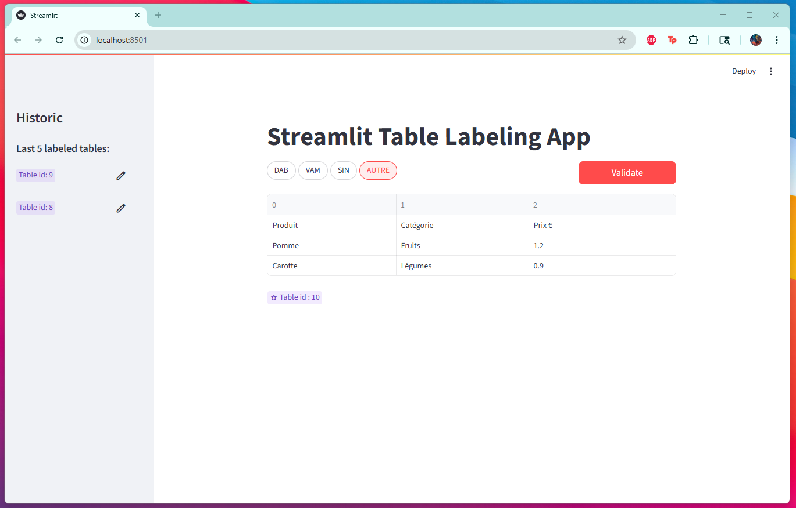
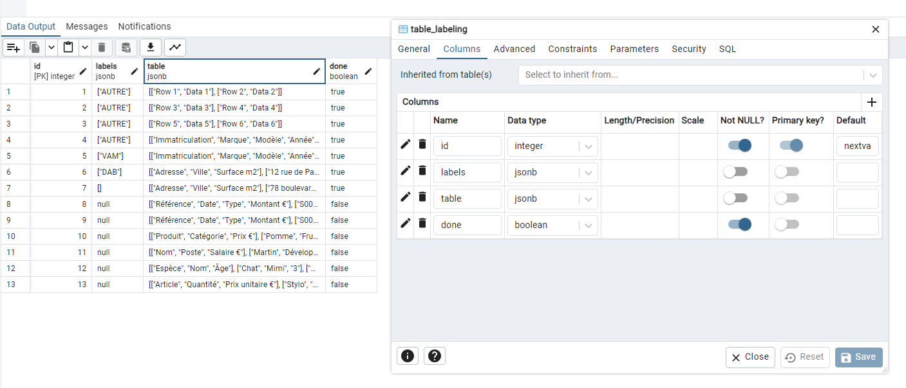

# streamlit-table-labeling

## Overview

`streamlit-table-labeling` is a Streamlit application for labeling data stored in a PostgreSQL database table.



## Installation

Clone the repository and install it in editable mode:

```bash
git clone https://github.com/yourusername/streamlit-table-labeling.git
cd streamlit-table-labeling

# Create virtual environment
python -m venv .venv
source .venv/bin/activate  # On Windows: .venv\Scripts\activate

pip install -e .
```

## Environment Variables

Add a `.env`file and set the following environment variables to connect to your PostgreSQL database:

- `DB_HOST`: Database host (e.g., `localhost`)
- `DB_PORT`: Database port (e.g., `5432`)
- `DB_NAME`: Database name
- `DB_USER`: Database user
- `DB_PASSWORD`: Database password

Example (Linux/macOS):

```bash
export DB_HOST=localhost
export DB_PORT=5432
export DB_NAME=mydatabase
export DB_USER=myuser
export DB_PASSWORD=mypassword
```

## Labels

The available labels for annotation are defined in `config.py` within the `Vars` enum class. You can customize these labels by editing the `Vars` class:

```python
from enum import Enum
class Vars(Enum):
    TABLE_LABELS = "DAB,VAM,SIN,AUTRE"
```

These labels will be presented in the Streamlit interface for selection during the labeling process.

## Database Table Fields

Your PostgreSQL table should contain at least the following fields:

- `id`: Primary key (integer)
- `data`: The data to be labeled (JSONB)
- `label`: The label assigned (JSONB)
- `done`: Indicates whether the labeling task is completed (boolean, e.g., `TRUE`/`FALSE`)


Example table schema:

```sql
CREATE TABLE labeling_table (
    id SERIAL PRIMARY KEY,
    data JSONB,
    label JSONB,
    done BOOL NOT NULL,
);
```
You can run the `database.py` file to test the connection to your database and add fake data to test the application.


## Running the Application

Start the Streamlit app with:

```bash
streamlit run src/streamlit_table_labeling/app.py
```
